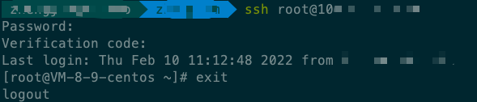
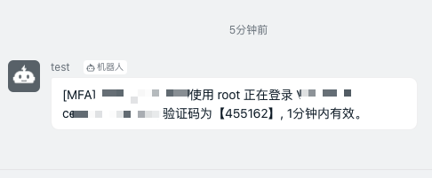

# 2sa_pam

为centos系统加上pam两次验证，对接第三方通知





日志在`/var/log/messages`下面

## 配置

安装前先修改配置 ，在`pam_notice_auth.py`文件的`Config`类修改。

**配置说明**

| 名字 | 说明 |
|---  |---  |
| EMERGENCY_HASH  | 预定义万能验证码,务必修改！ |
|PIN_LENGTH|PIN码长度|
|PIN_LIVE|PIN存活时间,超出时间验证失败|
|PIN_LIMIT|限制错误尝试次数|

**通知相关配置**

| 名字 | 说明 |
|---  |---  |
| open_tg  | 是否tg开启 默认不开启 |
|tg_token|tg bot 的token|
|tg_chat_id| tg 发送人id |
| open_dingding  | 是否钉钉开启 默认不开启 |
|dingding_token|钉钉机器人 的token|

## 安装

```
chmod +x ./pam_install_shell.sh 
./pam_install_shell.sh 
```

## 卸载

```
chmod +x pam_uninstall_shell.sh
./pam_uninstall_shell.sh
```
